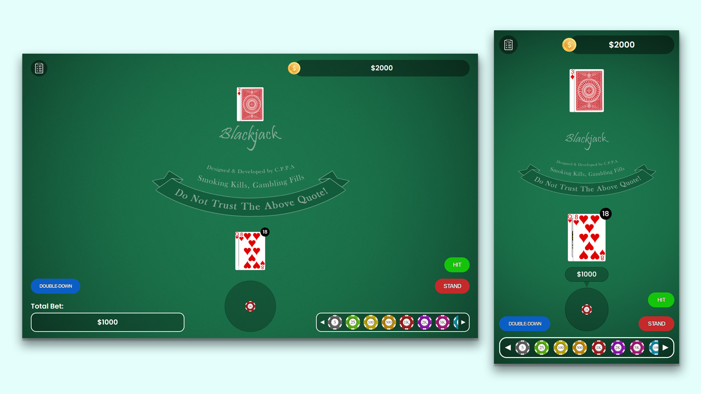

# BlackJack Card Game



# About

A feature-rich BlackJack card game built using vanilla JavaScript, SCSS, and designed with a strong focus on maintainability and scalability using the MVC (Model-View-Controller) architecture. The game includes intuitive UI, seamless animations, and a clear structure for ease of understanding and extension.

## Table of Contents

-  [Installation](#installation)
-  [Features](#features)
-  [Project Structure](#project-structure)
-  [Acknowledgements](#contributing)

## Features

-  **Interactive Gameplay**: Play the classic BlackJack game with responsive controls and real-time feedback.
-  **Smooth Animations**: Enhanced user experience with seamless animations for game components.
-  **Scalable Architecture**: Utilizes the MVC pattern for a clean and maintainable codebase.
-  **Modern Design**: UI and game flow designed with Figma, ensuring a visually appealing interface.


## Installation

1. Clone the repository:

   ```bash
   git clone https://github.com/your-username/BlackJack-card-game.git
   cd BlackJack-card-game
   ```

2. Install dependencies

   ```bash
      npm install
   ```

3. Start the game
   ```bash
      npm start
   ```

## Project Structure

```plaintext
├── static/img/              # Images used for the game
├── src/js/controllers/      # JavaScript files for controllers
├── src/js/models/           # JavaScript files for models/states
├── src/js/views/            # JavaScript files for views/UI
├── src/js/config/           # JavaScript files for constant variables
├── src/js/helpers/          # JavaScript files for helper functions
├── src/scss/                # SCSS files for styling components, layouts and animations
├── index.html               # Main HTML file
├── main.js                  # Entry point for JavaScript
└── README.md                # Project documentation
```

## Acknowledgements

### Design Tools

-  **Figma**
-  **Adobe Photoshop**

### DevDependencies

-  **@parcel/transformer-sass:** ^2.9.3
-  **parcel:** ^2.9.3
-  **parcel-reporter-static-files-copy:** ^1.5.2
-  **sass:** ^1.66.1
